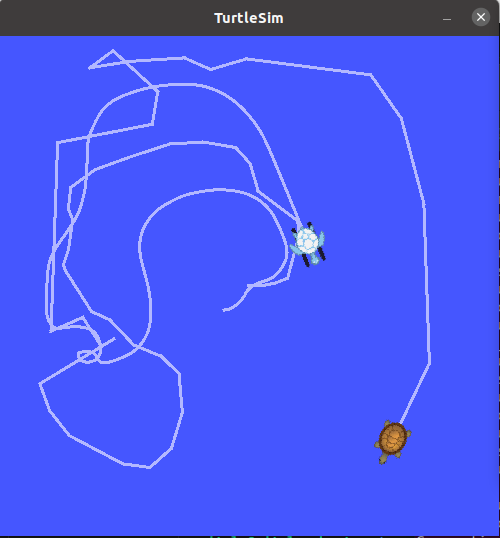

# Turtle chaser (ROS exercise)

ROS package with launch file that spawns two turtles. First turtle is controlled from keyboard, second turtle automaticaly chase first one.

## Showcase

Environment:

- OS: Ubuntu 20.04.6 LTS (Focal Fossa)
- ROS: Noetic 1.16.0
- Python: 3.8.10




## How to start

```bash
catkin_make  # first time after clone
source devel/setup.bash
roslaunch turtle_chaser chaser.launch
```

## Start rqt_graph node

```bash
rosrun rqt_graph rqt_graph
```
